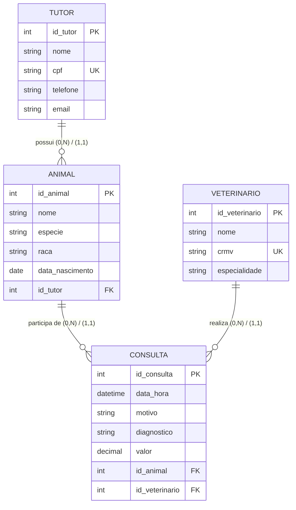

# Modelagem de Banco de Dados: Clínica Veterinária

**Unidade Curricular:** Banco de Dados
**Atividade:** Desafio de Aplicação da Aprendizagem (A3 – pontos extras)
**Autor(a):** _seu nome aqui_

---

## a) Contexto da situação

Escolhi um caso simulado: uma clínica veterinária de pequeno porte que registra atendimentos em cadernos e planilhas soltas. Isso gera problemas como dados do tutor repetidos a cada visita, histórico de saúde dos animais perdido e agendamentos conflitantes para o mesmo veterinário. Quem usará as informações são recepcionistas (cadastro e agenda), veterinários (histórico clínico) e o gestor (relatórios). Os dados a armazenar são tutores, animais, veterinários e consultas. Um banco de dados centraliza essas informações, evita duplicidade, garante o histórico e permite consultas rápidas, como "todas as consultas do animal X".

## b) Análise com base na Unidade Curricular

No levantamento de requisitos, identifiquei estas regras de negócio: um tutor pode ter vários animais; cada animal pertence a um único tutor; cada consulta envolve um animal e um veterinário; e um veterinário não pode ter duas consultas no mesmo horário.

Identifiquei quatro entidades, com chaves primárias (PK) e estrangeiras (FK):

- **TUTOR**: id_tutor (PK), nome, cpf, telefone, e-mail.
- **ANIMAL**: id_animal (PK), nome, espécie, raça, data_nascimento, id_tutor (FK).
- **VETERINARIO**: id_veterinario (PK), nome, crmv, especialidade.
- **CONSULTA**: id_consulta (PK), data_hora, motivo, diagnostico, valor, id_animal (FK), id_veterinario (FK).

Usei chaves substitutas (id) como identificadores, porque CPF e CRMV podem mudar ou ter erros de digitação. Eles ficam como atributos únicos (UNIQUE).

Os relacionamentos e suas cardinalidades (mínima, máxima) são:

- Tutor **possui** Animal: Tutor (0,N) e Animal (1,1).
- Animal **participa de** Consulta: Animal (0,N) e Consulta (1,1).
- Veterinário **realiza** Consulta: Veterinário (0,N) e Consulta (1,1).

Animal e Veterinário teriam, em princípio, um relacionamento N:N. Ele se resolve pela entidade CONSULTA, que funciona como entidade associativa e ainda guarda atributos próprios (data, diagnóstico, valor).

Na transformação para o modelo lógico relacional, cada entidade vira uma tabela, cada atributo vira uma coluna e cada registro vira uma linha. Os relacionamentos 1:N são representados por chaves estrangeiras no lado "N": id_tutor em ANIMAL, e id_animal e id_veterinario em CONSULTA. Isso garante integridade referencial, pois não existe consulta de animal inexistente. Separar tutor, animal e consulta em tabelas distintas elimina a redundância (os dados do tutor são gravados uma só vez) e mantém a consistência, já que uma alteração de telefone é feita em um único lugar. Também usaria a restrição UNIQUE (id_veterinario, data_hora) para impedir conflitos de agenda.

Como SGBD, escolheria o PostgreSQL, por ser gratuito, robusto e compatível com SQL padrão. Quanto à segurança, criaria perfis de acesso: a recepção atualiza cadastros e agenda, os veterinários registram diagnósticos e o gestor apenas consulta relatórios. Também faria backups periódicos e trataria os dados dos tutores conforme a LGPD.

### Esboço do DER

O modelo lógico em SQL (PostgreSQL) está em [`sql/schema.sql`](sql/schema.sql).

## c) Desenvolvimento profissional

Quero aprimorar minha escrita de consultas SQL com JOINs, agrupamentos e subconsultas, além da aplicação das formas normais (1FN, 2FN e 3FN) em casos mais complexos. Também desejo aprender mais sobre segurança de banco de dados, como controle de permissões e proteção de dados pessoais.

## d) Ação concreta de desenvolvimento

Nas próximas duas semanas, vou desenhar este DER no brModelo (ou dbdiagram.io), implementá-lo no PostgreSQL, inserir dados fictícios e praticar dez consultas SQL, como consultas por animal, faturamento por veterinário e agenda do dia.

---

_Caso simulado, criado para fins acadêmicos. Nenhum dado real foi utilizado._
